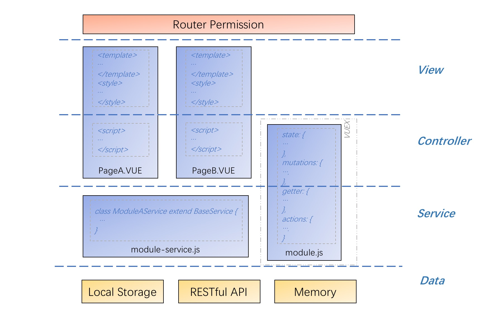
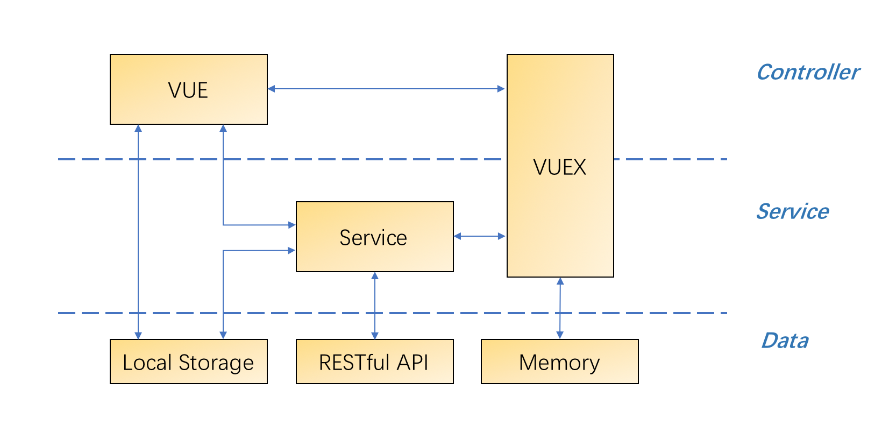

## 互联开放平台(Internet open platform)

### 环境依赖

* node
* yarn
* webpack
* eslint
* [vue-cli3](https://cli.vuejs.org/guide/)
* [ant-design-pro-vue](https://pro.loacg.com/docs/getting-started)-[2.0.2](https://github.com/sendya/ant-design-pro-vue/tree/2.0.2)


### 开发工具

1. 编译器

推荐 [VS Code](https://code.visualstudio.com/download)

* 插件

  [EsLint](https://marketplace.visualstudio.com/items?itemName=dbaeumer.vscode-eslint)，[Prettier Now](https://marketplace.visualstudio.com/items?itemName=remimarsal.prettier-now)，[Vetur](https://marketplace.visualstudio.com/items?itemName=octref.vetur)

* 配置

```json
"[javascript]": {
  "editor.formatOnSave": true
},
"editor.codeActionsOnSave": {
  "source.fixAll.eslint": true,
  "source.organizeImports": true
},
"editor.formatOnPaste": true,
"editor.formatOnSave": true,
"editor.tabSize": 2,
"files.autoSave": "onFocusChange",
"javascript.format.insertSpaceAfterSemicolonInForStatements": false,
"javascript.format.insertSpaceBeforeFunctionParenthesis": true,
"javascript.updateImportsOnFileMove.enabled": "always",
"prettier.singleQuote": true,
"prettier.spaceBeforeFunctionParen": true,
"prettier.tabWidth": 2,
"prettier.useTabs": false,
"prettier.semi": false,
"typescript.format.insertSpaceAfterSemicolonInForStatements": false,
"vetur.format.defaultFormatter.html": "prettyhtml",
"vetur.format.defaultFormatter.js": "vscode-typescript",
"vetur.format.defaultFormatterOptions": {
  "prettier": {
    "singleQuote": true,
    "semi": false,
    "eslintIntegration": true,
    "spaceBeforeFunctionParen": true
  }
}
```


2. 浏览器

开发阶段不支持IE浏览器，建议使用Chrome。


### 架构




调用关系




### 目录结构

* 全局
```
├─ docs											# 文档
├─ public
|   ├─index.html						# Vue入口模板
├─ src
|  ├─main.js								# Vue入口js
|  ├─ assets								# 静态资源
|  ├─ config								# 基础配置，包括路由，全局配置等
|  ├─ core									# 全局配置初始化，依赖包引入等
|  ├─ layouts								# 页面布局
|  ├─ mock									# Mock定义
|  ├─ router								# 路由定义
|  ├─ service								# Service基类
|  ├─ store									# Vuex定义
|  ├─ utils									# 工具库
|  ├─ iop										# 平台子系统
|  ├─ iop-system1						# 子系统1
|  ├─ iop-system2						# 子系统2
├─ tests										# 测试 
├─package.json
├─README.md
```


* 子系统

  各子系统constants、service、views目录下的index.js文件导出常量、service和页面，便于其它子系统(模块)复用。mock和store下的index.js，便于全局的mock和store引入。
```
├─ src
|  ├─ iop
|  |  ├─ api								# 后台接口url定义					
|  |  |  └index.js					
|  |  ├─ components					# 通用组件
|  |  |     └index.js				
|  |  ├─ constants					# 常量
|  |  |     └index.js				
|  |  ├─ mock								# Mock
|  |  |  └index.js					
|  |  ├─ service						# Service
|  |  |    └index.js
|  |  ├─ store							# Vuex
|  |  |   └index.js				
|  |  ├─ views							# 页面
|  |  |   └index.js
```

  

导出的类或方法前，应加上子系统的名称前缀，避免重复

```javascript
import appService from './auth/app'
import authService from './auth/index'
import tokenService from './auth/token'

export {
  areaService as iopAreaService,
  appService as iopAppService,
  authService as iopAuthService
}

```


### 命名规则

文件夹和文件的命名拼写建议与后台接口的url拼写保持一致，便于查找和维护。

* 目录

  使用小写字母，如果需要连接多个单词，用`-`连接(脊柱命名法(`floder-name`))。

* 文件

  `.vue`文件首字母大写，使用驼峰命名法(`FileName`)。
  除`.vue`文件外，其它类型的文件使用小写字母，如果需要连接多个单词，用`-`连接(脊柱命名法(`file-name`))。

* 类

  首字母大写，如果需要连接多个单词，使用驼峰命名法(`ClassName`)。

* 方法

  首字母小写，如果需要连接多个单词，使用驼峰命名法(`funcName`)。私有方法用`__`开头(两个`_`，`__funcName`)。

* 变量

  首字母小写，如果需要连多过个单词，使用驼峰命名法(`variableName`)。
  私有变量用`__`开头(两个`_`，`__variableName`)。
  常量字母全大写，如果需要连多过个单词，用`_`连接(蛇形命名法(`VARIABLE_NAME`))。

* 属性

  建议与DTO/VO的属性名保持一致。


### 名词解释

* DTO(dto)，Data Transfer Object，一般指后台接口返回的数据对象。
* VO(vo)，Value Object，一般特制列表查询接口的dto，或者表格列和表单项的定义。


### 接口调用规约

1. 接口使用rest风格，url一律使用小写字母，如果需要使用多个单词，用`-`连接(脊柱命名法(`floder-name`))
2. 常用场景的接口调用方式

| 序号 | 场景     | url            | 请求方式 |
| ---- | -------- | -------------- | -------- |
| 1    | 列表 | /子系统/模块/功能 | GET |
| 2 | 详情 | /子系统/模块/功能/主键 | GET |
| 3 | 新建 | /子系统/模块/功能 | POST |
| 4 | 编辑 | /子系统/模块/功能/主键 | PUT |
| 5 | 删除 | /子系统/模块/功能/主键 | DELETE |

3. dto格式

* 基础格式

```json
{
  message: '', // 提示信息
  timestamp: 0, // 时间戳
  result: null,  // 数据
  code: 0, // 请求结果编码
  success: true // 请求的业务是否成功
}
```


* 列表查询result部分

```json
{
    size: 10, // 每页行数
    data: [],  // 数据
    totalSizes: '0', // 总条数
    totalPages: 0, // 总页数
    page: 1 // 当前页数
  }
```


### 开发环境

#### 安装依赖

命令行执行

```shell
yarn install
```

或

```shell
npm install
```


#### 启动

命令行执行

```shell
yarn run serve
```

或

```shell
npm run serve
```


### 新增页面示例

以新建`iop系统->系统管理->菜单管理`为例。

1. url

在`src->iop->api`下新建`index.js`，定义后台接口的地址，如：

```javascript
const context = '/iop/'
export const url = {
  system: {
    menus: {
      list: `${context}system/menus`
      ...
    }
  }
}
```


2. service

在`src->service->iop->system`目录下新建`menu.js`，新建继承`BaseService`的service类`MenuService`。`BaseService`提供了基础的get、post、put、patch、delete请求，并返回Promise对象。当http响应状态码为200视为请求成功，后台接口返回DTO的`success`属性为`true`视为业务成功。当请求成功并且业务成功，视为`resolved`；请求失败和业务失败均视为`rejected`。示例代码如下：

使用`async`和`await`，
```javascript
import url from '@/iop/api/index'
import BaseService from '@/service/base'

class MenuService extends BaseService {  
  async list (params = { size: 10, page: 0 }) {
    const { result } = await this.get({
      url: url.system.menus,
      params
    })
    // do something
    return result
  }
  ...
}
  
export default new MenuService()
```


或者使用`Promise`对象

```javascript
import url from '@/iop/api/index'
import BaseService from '@/service/base'

class MenuService extends BaseService {  
  list (params = { size: 10, page: 0 }) {
    return new Promise((resolve, reject) => {
      this.post({
        url: url.system.menus,
        params
      })
       .then((res) => {
          // do something
          return res.result
        })
       .catch((error) => { 
         reject(error)
        })
    })
  }
  ...
}
  
export default new MenuService()
```
> 注意，把异常作为参数传递出去


基类方法接收参数对象的属性如下：

| 序号 | 属性     | 类型   | 说明                                                         |
| ---- | -------- | ------ | ------------------------------------------------------------ |
| 1    | url      | String | 请求的地址，支持参数格式，如'/iop/system/menus'、'/iop/system/menus/:id' |
| 2    | params   | Object | url参数                                                      |
| 3    | variable | Object | 按照属性名，将属性值替换到url上，如{ id: '12321' } => '/iop/system/menus/12321' |
| 4    | data     | Onject | 请求发送的数据，仅适用于put、post、patch方法                 |

>service方法内部不建议处理异常。


3. VUE页面上引用service

使用`async`和`await`，
```vue
<template>
  ...
</template>
<script>
import { iopMenuService } from '@/iop/service/index'
  ...
export default {
    ...
    	try {
        const data = await iopMenuService.list()
        // do something
      } catch (error) {
        this.handleFailed(error)
      } finally {
        // do something
      }
    ...
}
</script>
<style>
  ...
</style>
```

或者使用`Promise`对象

```vue
<template>
  ...
</template>
<script>
import { iopMenuService } from '@/iop/service/index'
  ...
export default {
    ...
      iopMenuService.list()
        .then((res) => {
          // do something
        })
        .catch((error) => {
          this.handleFailed(error)
        })
        .finally(() => {
          // do something
        })
    ...
}
</script>
<style>
  ...
</style>
```

4. 页面菜单

启动项目，在菜单管理功能中添加信息，主要字段信息如下所示：
```json
{
  name: 'menus',
  path: '/system/menu',
  title: '菜单管理',
  icon: 'table',
  component: 'iop/views/system/menu/list'
}
```


### 接口联调

1. 修改`vue.config.js`中的`devServer`，将请求代理到后台服务器，如后台服务部署在localhost的8080端口，配置如下：

```javascript
devServer: {
  // development server port 8000
  port: 8000,
  proxy: {
    '/iop/system/menus': {
      target: 'http://localhost:8080'
    }
  }
}
```

> devServer的代理信息，建议保留(注释后提交)，供部署参考。


### 编译

命令行执行

```shell
yarn run build
```

或

```shell
npm run build
```


### 部署

拷贝`dist`目录下的文件到nginx目录

> nginx代理配置，可参考`vue.config.js`中的`devServer`代理配置


### 附录

* [编程风格](./docs/code-style.md)

* [表格组件](./docs/components/data-table-page.md)

* [字典组件](./docs/components/data-dict.md)

* [表单组件](./docs/components/data-form.md)

* [树组件](./docs/components/data-tree.md)

* [下拉树组件](./docs/components/data-tree-select.md)

* UI规范

1. 列表页，列表默认显示允许用户查询的所有字段

2. 列表页，查询和重置按钮靠右显示
``` vue
<a-col class="search-buttons">
  <a-button type="primary" @click="search()">查询</a-button>
  <a-button @click="resetSearchForm()">重置</a-button>
</a-col>
```

3. 列表页，如果查询条件只有一个，则居中显示，使用a-input-search组件，不需要重置按钮
``` vue
<a-col :span="12" :offset="6">
  <a-input-search
    allowClear
    enter-button="查询"
    @search="search"
    placeholder="请输入编码值名称" />
</a-col>
```

4. 列表页，查询输入框添加allowClear属性，并监听pressEnter事件实现回车键查询
``` vue
 <a-input allowClear @pressEnter="search" />
```

5. 表单页，数字类型使用a-input-number组件，并指定输入的最大值和最小值
``` vue
<a-input-number :min="1" :max="100000" style="width:100%;" />
```

6. 表单页，输入项必须校验输入的长度，默认规则文本类长度100，备注类500

7. 表单页，输入项添加placeholder，并明确提示出需要输入的字段名称或者输入项格式，只提示`请输入`没有实际意义

8. 状态切换使用a-switch组件，内联标签显示清楚，如：禁用/启用，不允许/允许等。一般新建状态下为开启(启用、允许等)状态
``` vue
<a-switch checked-children="启用" un-checked-children="注销" default-checked />
```

9. 备注类或较长的输入项，使用a-textarea组件
``` vue
<a-textarea :autosize="{ minRows: 4, maxRows: 6 }"/>
```

10. 选择项，建议5个选项(表单布局只有一列)以内使用radio，大于5项使用select。列表选项按照逻辑排序，并尽量让内容显示完整

11. 弹窗底部的按钮居中显示，取消/关闭按钮在左侧，确定/提交按钮在右侧

11. 注意按钮之间的空隙、是否应该有分割线

12. 页面响应式布局
``` vue
<a-row :gutter="{ xs: 8, sm: 16, md: 24, lg: 32 }" />
<a-form-item label="登录名" v-bind="formItemLayout" />
```
``` json
formItemLayout: {
  labelCol: {
    xs: { span: 24 },
    sm: { span: 8 }
  },
  wrapperCol: {
    xs: { span: 24 },
    sm: { span: 16 }
  }
}
```