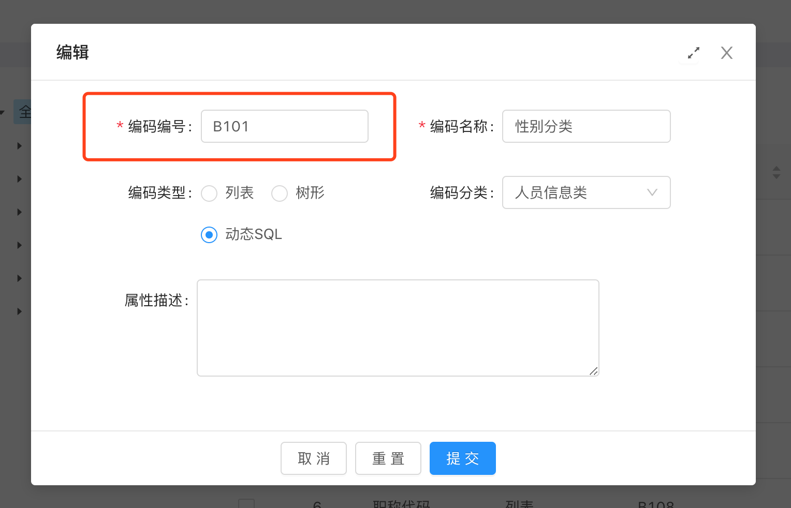

## 字典组件

基于官方Select、RadioGroup、CheckboxGroup组件的二次封装。提供字典项数据查询，加载选项的功能。


### 名词解释

* 字典分类
* 字典定义
* 字典项


### 引入

* Selct

```javascript
import { IopDataDictSelect } from '@/iop/components'
```

* RadioGroup

```javascript
import { IopDataDictRadio } from '@/iop/components'
```

* CheckboxGroup

```javascript
import { IopDataDictCheckbox } from '@/iop/components'
```


### 属性

| 序号 | 名称 | 类型   | 必填 | 默认值 | 说明                   |
| ---- | ---- | ------ | ---- | ------ | ---------------------- |
| 1    | type | string | 是   | --     | 字典定义`编码编号`的值 |




### 事件

* onChange

| 序号 | 属性  | 说明     |
| ---- | ----- | -------- |
| 1    | value | 选择的值 |


### 方法

* Select

  * setSelected (value = '')，设置选中项，暂不支持设置多个选中项

  | 序号 | 参数  | 必填 | 默认值 | 说明     |
  | ---- | ----- | ---- | ------ | -------- |
  | 1    | value | 是   | --     | 选中的值 |

  * cleanSelected ()，清除选中项
