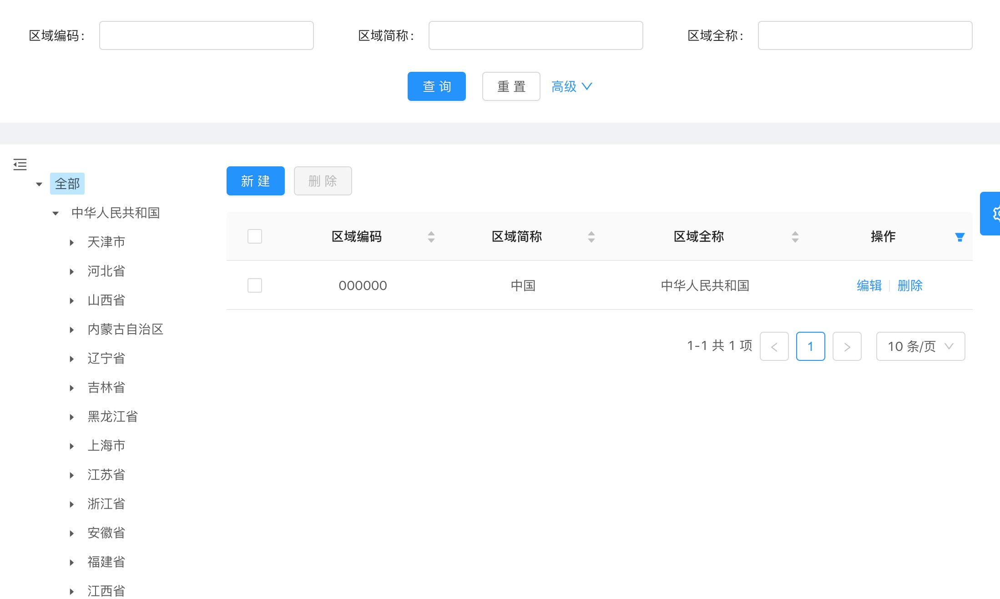

## 表格组件

基于官方表格组件的二次封装。提供数据加载、刷新、翻页、删除等功能及页面布局。



### 规约

* 包含表格的文件命名一般以`List`结尾
* 表格的列定义单独保存为`.js`文件，放在页面文件同级的`vo`文件夹下，一般以`-list-vo`结尾


### hello world

1. 引入

```javascript
import { IopDataTablePage } from '@/iop/components'

export default {
  name: 'HelloWorld',
  components: { IopDataTablePage }
}
```


2. 定义属性

* 主键字段，如主键字段为`id`

```javascript
table: {
	rowKey: 'id'
}
```


* 列定义，数组类型。如：

```javascript
table: {
  columns: [{
  	title: '名称',
  	dataIndex: 'name'
	}, 
  {
  	title: '编码',
  	dataIndex: 'code'
	}
  ]
}
```


* table.url，加载数据的接口地址


* permission，按钮权限，如

```javascript
permission: ['create', 'edit', 'view', 'remove', 'removeSelected']
```


3. 完整代码(最小化配置)

```vue
<template>
  <iop-data-table-page
    ref="helloWorld"
    :table="table"
    :permission="permission" />
</template>
<script>
import { IopDataTablePage } from '@/iop/components'

export default {
  name: 'HelloWorld',
  components: { IopDataTablePage },
  data () {
    return {
      table: {
        rowKey: 'id',
      	url: url,
        columns: [{
        	title: '名称',
        	dataIndex: 'name'
      	}, 
      	{
        	title: '编码',
        	dataIndex: 'code'
      	}
      	]
      },
      permission: ['create', 'edit', 'view', 'remove', 'removeSelected']
    }
  }
}
</script>
```


### 配置项

| 序号 | 名称       | 类型          | 必填 | 默认值 | 说明                                                         |
| ---- | ---------- | ------------- | ---- | ------ | ------------------------------------------------------------ |
| 1    | table      | Object        | 是   | --     | 表格配置                                                     |
| 2    | permission | Array<string> | 否   | []     | 内置表格操作按钮权限，数组项对应按钮的名称，如['create', 'view', 'edit']对应`新建`、`查看`和`编辑` |
| 3    | tree       | boolean       | 否   | false  | 渲染左侧树插槽                                               |
| 4    | hiddenTop  | boolean       | 否   | false  | 隐藏搜索区域                                                 |


* table

| 序号 | 名称       | 类型               | 必填 | 默认值 | 说明               |
| ---- | ---------- | ------------------ | ---- | ------ | ------------------ |
| 1    | rowKey     | [string, Function] | 是   | --     | 主键               |
| 2    | pageable   | boolean            | 否   | true   | 分页               |
| 3    | selectable | boolean            | 否   | true   | 行选择项           |
| 4    | filterable | boolean            | 否   | true   | 筛选显示的列       |
| 5    | actions    | boolean            | 否   | true   | 显示操作列         |
| 6    | serial     | boolean            | 否   | true   | 显示序号列         |
| 7    | buttons    | boolean            | 否   | true   | 显示表格上方的按钮 |
| 8    | url        | string             | 是   | --     | 表格加载的接口地址 |
| 9    | columns    | Array<Object>      | 是   | --     | 列定义             |

> rowKey支持`rowKey: (record) => record.id`格式


* table.columns

列的配置项。可以使用生成工具生成

| 序号 | 名称         | 类型                              | 必填 | 默认值 | 说明                                                         |
| ---- | ------------ | --------------------------------- | ---- | ------ | ------------------------------------------------------------ |
| 1    | title        | string                            | 是   | -      | 列头显示文字                                                 |
| 2    | dataIndex    | string                            | 是   | -      | 列数据在数据项中对应的 key，支持 `a.b.c` 的嵌套写法          |
| 3    | hidden       | boolean                           | 否   | false  | 隐藏                                                         |
| 4    | align        | 'left'&#124;'right'&#124;'center' | 否   | 'left' | 设置列内容的对齐方式                                         |
| 5    | width        | number                            | 否   | -      | 列宽度                                                       |
| 6    | sorter       | boolean                           | 否   | false  | 可以排序(服务器端)                                           |
| 7    | customRender | Function(text, record, index) {}  | 否   | -      | 生成复杂数据的渲染函数，参数分别为当前行的值，当前行数据，行索引 |

customRender示例

```json
{
    title: '状态',
    dataIndex: 'status',
    customRender: (text) => {
      if (text) {
        return '已设置'
      } else {
        return '未设置'
      }
    }
  }
```

> vo文件定义的customRender方法中，不支持返回组件的标签。
>
> 若需要返回标签，应把columns的定义拷贝到页面(.vue)文件中。


### 事件

* onAction ({ name = '', data = { } })

| 序号 | 属性          | 类型   | 说明     |
| ---- | ------------- | ------ | -------- |
| 1 | name          | string | 动作名称 |
| 2 | data.original | Object | 数据     |
| 3 | data.extra    | Object | 扩展预留。onRemove返回删除的行数据；onRemoveSelected返回选中的行数据。 |

内置的动作：

| 序号 | 动作名称         | 数据                                     | 说明                                         |
| ---- | ---------------- | ---------------------------------------- | -------------------------------------------- |
| 1    | onCreate         | -                                        | 点击表格上方的`新建`按钮触发                 |
| 2    | onView           | 行数据                                   | 点击行`查看`按钮触发                         |
| 3    | onEdit           | 行数据                                   | 点击行`编辑`按钮触发                         |
| 4    | onRemove         | rowKey                                   | 点击行`删除`按钮，删除行数据成功后触发       |
| 5    | onRemoveSelected | 选中行的rowKey数组                       | 点击表格上方的`删除`按钮，删除数据成功后触发 |
| 6    | onClearSelected  | --                                       | 点击表格上方的`清空`按钮触发                 |
| 7    | onSelectedChange | 选中的行数据rowKey数组和选中的行数据数组 | 表格选中的行数据变化                         |

> 若tree属性设置为false，数据删除成功后，会自动执行表格的reload方法


用事件处理行`查看`按钮触发的事件

```vue
<template>
  <iop-data-table-page
    ref="helloWorld"
    :table="table"
    :permission="permission"
    @onAction="onAction" />
</template>
<script>
  ...
  methods: {
    onAction ({ name = '', data = {} } = {}) {
      switch (name) {
        case 'onView':
          console.log('onView, id: ', data.original.id)
          break
      }
    }
  ...
</script>
```


### 方法

* reload (params = {}, { firstPage = true } = {}) 

  查询、加载数据

| 序号 | 参数 | 类型 | 必填 | 默认值 |说明 |
| ---- | ---- | ---- | ---- | ----| -------- |
| 1 | params | Object | 否 | {} | 查询参数，以`&${key}=${name}`的格式拼在加载数据的url上，如:`/iop/auth?key1=value1&key2=value2` |
| 2 | option.firstPage | boolean | 否 | true | 是否返回到第一页 |

* search ()

  获取搜索区域被`v-decorator`修饰的控件输入值，并作为参数查询、加载数据

* resetSearch ()

  重置搜索区域被`v-decorator`修饰的控件

  > 若使用search和resetSearch方法，搜索区域不要再定义表单标签(<a-form>)
  >
  > resetSearch方法暂不支持重置字典控件

* clearSelected ()

  清空表格选中项


### 按钮权限

控制默认按钮是否显示，默认值为[]，内置按钮对应的权限值：

| 序号 | 名称           | 按钮                         |
| ---- | -------------- | ---------------------------- |
| 1    | create         | 表格上方的`新建`按钮         |
| 2    | edit           | 行`编辑`按钮                 |
| 3    | view           | 行`查看`按钮                 |
| 4    | remove         | 行`删除`按钮                 |
| 5    | removeSelected | 表格上方的`删除`(删除所选项) |


### 插槽

| 序号 | 名称                       | 说明                                                         |
| ---- | -------------------------- | ------------------------------------------------------------ |
| 1    | top                        | 页面上方区域，一般为搜索表单部分                             |
| 2    | headerButtons              | 表格上方按钮区域                                             |
| 3    | beforeCreateButton         | 表格上方`新建`按钮前面区域                                   |
| 4    | createButton               | 表格上方`新建`按钮(需`create`权限)                           |
| 5    | afterCreateButton          | 表格上方`新建`按钮后面、`beforeRemoveSelectedButton`前方区域 |
| 6    | beforeRemoveSelectedButton | 表格上方`删除`按钮前面区域                                   |
| 7    | removeSelectedButton       | 表格上方`删除`按钮(需`removeSelected`权限，不含`清空`按钮)   |
| 8    | afterRemoveSelectedButton  | 表格上方`删除`按钮后面区域                                   |
| 9    | rowButtons                 | 行按钮区域                                                   |
| 10   | beforeViewButton           | 行`查看`按钮前面区域                                         |
| 11   | viewButton                 | 行`查看`按钮(需`view`权限，含分割线)                         |
| 12   | afterViewButton            | 行`查看`按钮后面、`beforeEditButton`前面区域                 |
| 13   | beforeEditButton           | 行`编辑`按钮前面区域                                         |
| 14   | editButton                 | 行`编辑`按钮(需`edit`权限，含分割线)                         |
| 15   | afterEditButton            | 行`编辑`按钮后面区域、`beforeRemoveButton`前面区域           |
| 16   | beforeRemoveButton         | 行`删除`按钮前面区域                                         |
| 17   | removeButton               | 行`删除`按钮(需`remove`权限)                                 |
| 18   | afterRemoveButton          | 行`删除`按钮后面区域                                         |


所有行插槽可获取当前行的记录(属性值为`record`)，如替换默认的行编辑按钮点击事件：

```vue
<template>
  <iop-data-table-page
    ref="helloWorld"
    :table="table"
    :permission="permission"
    @onAction="onAction"
  >
    <template #editButton="{ record }">
      <a @click="handleEdit(record.id)">编辑</a>
      <a-divider type="vertical" />
    </template>
  </iop-data-table-page>

</template>
<script>
  ...
  methods: {
    handleEdit (id = '') {
      console.log('edit, id: ', id)
    }
    ...
  }
</script>
```

> 使用事件和插槽均可替换默认的按钮事件，建议统一使用某一种方式，优先推荐插槽。


### 带查询条件的示例

> `编辑`使用插槽，`新建`和`查看`使用事件，请自行使用统一的处理方式
>
> 搜索部分的样式请自行调整

```vue
<template>
  <iop-data-table-page
    ref="helloWorld"
    :table="table"
    :permission="permission"
    @onAction="onAction"
 >
    <template #top>
      <a-form layout="inline">
        <a-form-item label="名称">
      	  <a-input v-model="queryParam.name" placeholder="请输入" />
  	    </a-form-item>
        <a-form-item label="编码">
          <a-input v-model="queryParam.code" placeholder="请输入" />
        </a-form-item>
        
        <a-button type="primary" @click="search()">查询</a-button>
        <a-button style="margin-left: 8px" @click="resetSearchForm()">重置</a-button>
      </a-form>
    </template>

    <template #editButton="{ record }">
      <a @click="handleEdit(record)">编辑</a>
      <a-divider type="vertical" />
    </template>
  </data-table-page>
</template>
<script>
import { IopDataTablePage } from '@/iop/components'

export default {
  name: 'HelloWorld',
  components: { IopDataTablePage },
  data () {
    return {
      table: {
        rowKey: 'id',
      	url: url,
        columns: [{
        	title: '名称',
        	dataIndex: 'name'
      	}, 
      	{
        	title: '编码',
        	dataIndex: 'code'
      	}
      	]
      },
      permission: ['create', 'edit', 'view', 'remove', 'removeSelected'],
      queryParam: {}
    }
  },
  methods: {
    /**
     * 处理表格事件
     *
     * @param {string} name 按钮动作
     * @param {Object} data 数据
     */
    onAction ({ name = '', data = {} } = {}) {
      switch (name) {
        case 'onCreate':
          console.log('onCreate, id: ', data.original.id)
          break
        case 'onView':
          console.log('onView, id: ', data.original.id)
          break
      }
    },
    
    /**
     * 编辑
     *
     * @param {string} id 主键
     */
    handleEdit ({ id = '' } = {}) {
      console.log('edit, id: ', id)
    },
    
    /**
     * 搜索
     */
    async search () {
      try {
        await this.$refs.helloWorld.reload(this.queryParam)
      } catch (error) {
        this.handleError(error)
      }
    },
    
    /**
     * 重置搜索条件
     */
    resetSearchForm () {
      this.queryParam = {}
    }
  }
}
</script>
```


### 更新记录

* `url`属性移到`table`属性下
* `model`属性改为`columns`，移到`table`属性下

